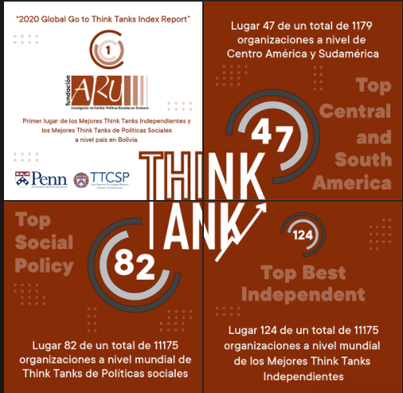

background-image: url(https://i1.wp.com/www.sdsnbolivia.org/wp-content/uploads/2018/07/logo_aru.jpg?resize=500%2C224&ssl=1)

```{r setup, include=FALSE}
options(htmltools.dir.version = FALSE)
```

???

---

# Aru

La Fundación ARU es una organización sin fines de lucro, independiente y plural que desarrolla investigación para las políticas públicas con el compromiso de producir y promover investigación aplicada de alta calidad a partir de herramientas globales, orientadas a informar e influir en el debate sobre políticas públicas a partir de evidencia científica.


## Misión y visión

Es misión de la Fundación Aru fortalecer la investigación aplicada y promover la formación orientada a la investigación en Bolivia.

Fundación ARU tiene la visión de contribuir a la construcción de una sociedad más inclusiva, cohesionada, con igualdad de oportunidades a partir de políticas públicas más efectivas.

---

## Hitos

  * Nace: 31 de Agosto de 2007 con cuatro grupos 
    + Economía Política, 
    + Monitoreo y Evaluación, 
    + Modelación Macroeconómica y 
    + Energía y Desarrollo
    
  * 2010, Aru y otras 49 instituciones participan en la TTI. Concluyó el 2019

  * Desde 2015 la organización es por unidades
    + Unidad de investigación
    + Unidad de microdatos y encuestas
    + Unidad de gestión de conocimiento
    + Unidad administrativa y gestión de comunicaciones

  * Directores de Aru:
    + Werner Hernani, 2007-2014  
    + Paul Villarroel, 2015-2018 
    + Wilson Jimenez, 2019-2020  
    + Alvaro Chirino, 2021-2022  

---

# Global go think tank index  
  


---

class: middle

# Organización

 

---

# Estructura

  * Unidad de investigación
    + 8 Seniors; WJ, MV, EY, PV, NP, CT, AF, AC 
    + 3 Investigadores; NE, PO, SG
    + 4 Asistentes; NM, FC, DF, GB
    + 5 Pasantes 2021;
    
  * Unidad de datos
    + 1 Temática/estadística (link); LA
    + 1 Paradata; BM 
    + 1 Sistema; SM
    + 1 Pasante; 
    
  * Unidad de administración y comunicación
    + 1 Oficial administrativo; TT
    + 1 Oficial junior de comunicación; SP
    + 1 Pasante administrativo; 
    + 1 Pasante diseño gráfico; 
    
---

# Iniciativas

  + Externas
    * Talleres de investigación aplicada
    * Encuentros basados en evidencia
    * Comunidades informadas
    * Red Boliviana de microdatos y encuestas
    * Competencia de posters estadísticos
    * Aru learning
    * Metadatos
  
  + Internas 
    * Aru - Digital
    * Aru learning interno
    * Gestión de publicaciones e investigadores
    * Gestión de redes y propuestas
    * Datum data
    * Datum gis
  
---

# Función de producción de la investigación en Aru


  * Investigación propia (agenda de los investigadores)
  
  * Investigación basados en proyectos (Agenda de las instituciones)

 

---

# Pasantías 2021

  * Duración: 3 meses
  * Horas semanales: 18 horas
  * Horario flexible: 8:00 - 19:00 
  * Modalidad: Virtual/presencial
  * Según evaluación: 3 meses más de pasantía y posterior a ello incorporación como asistentes.
  * Seguimiento: Quincenal, reportes mensuales
  * Convenio de pasantía; Modelo
  
  * Capacitación interna; Stata, R, Latex 
  * Comunicación: Telegram, mail

---

class: middle

# Pasantes Investigación/Datos

  * Asignación de tiempo
    + 50% Proyecto de pasantía
    + 30% Apoyo a investigadores
    + 20% Capacitación
  
---

# Proyecto de pasantía (investigación/datos)

*Ver hasta donde pueden crecer en 3 meses*

  * (Agenda emergente) Réplica/actualización de documentos de investigación (Entorno Bolivia++):
    + Género
    + Emprendedurismo
    + Generacional
    + Protección social / Vulnerabilidad
    + Pobreza Multidimensional
    + Macroeconómica
    
  * Evaluación de impacto: 
    + Salud (ENDSA)
    + Educación (UNESCO)
    + Agropecuario (ENA/CENSO)
    
  * Sistemas de información
    + Web scraping (Proxi a indicadores económicos)
  
**Remember google is still your best friend**
---
class: middle

# Pasante diseño gráfico

Supervisora: Stefany

  * Continuar la línea gráfica de Aru 
  
  * Apoyar las iniciativas internes/externas
  
  * Apoyar en Aru - Digital
  
  * Apoyar en el contenido de redes y página web

---

# Pasante Administrativo

Supervisor: Tommy Tapia

  * Apoyo a gestión administrativa
  
  * Apoyo a gestión financiera
  
  * Apoyo a gestión del talento humano (Internal Branding)
  
  * Apoyo logístico

---

class: center, middle, inverse

# Gracias...